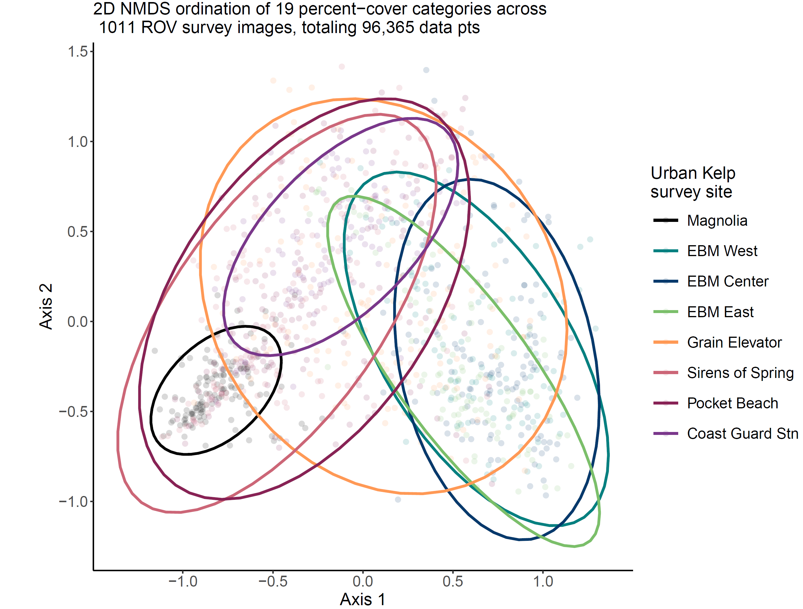
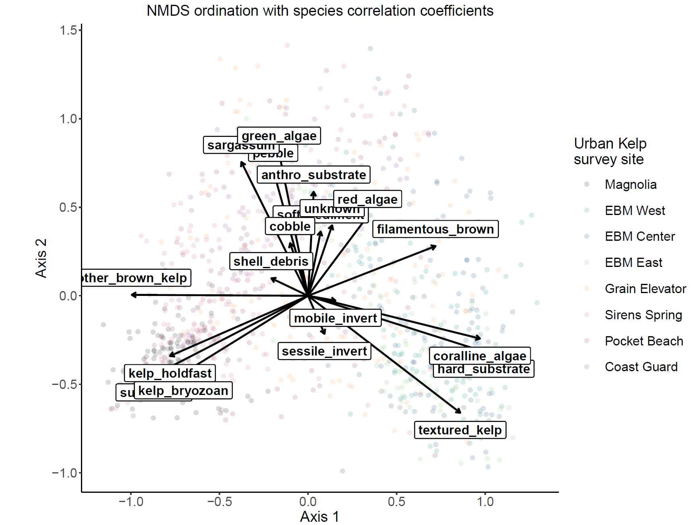
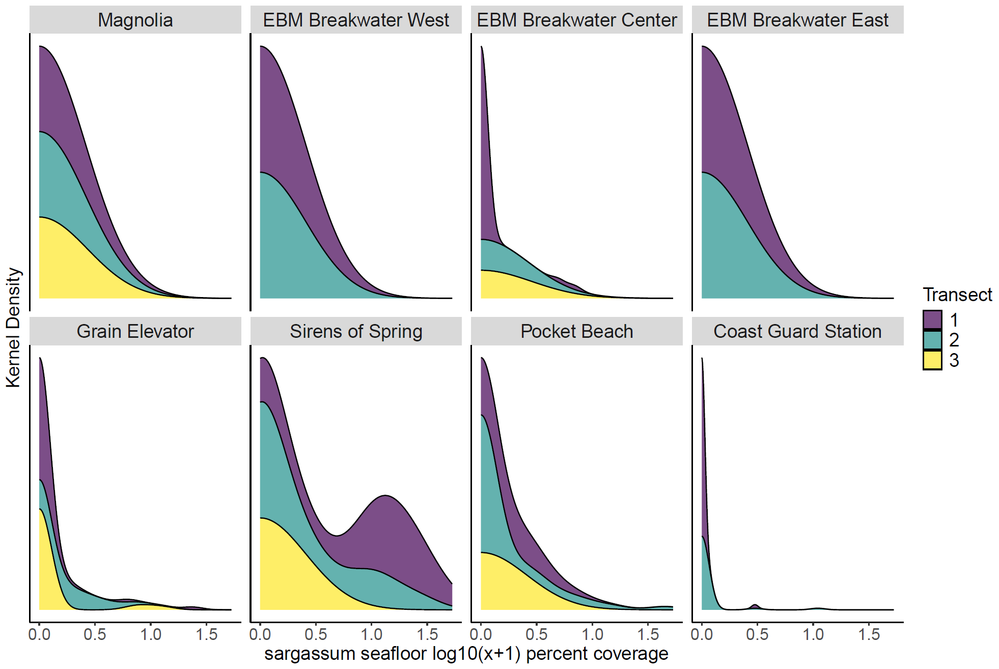

# CCR benthic analyses
This repo contains code and data to perform analyses and visualizations of percent-cover data exported from CoralNet. 

### code
- `diversity_metrics.R`: calculate species richness and the Shannon-Weiner diversity metric, Stimpson's diveristy metric, and Peilou's evenness, used in conjunction with the Shannon-Weiner matric. 
- `diversity_metrics_functions.R`: functions necessary to calculate spp diveristy, collate the output, and save a .csv file.
- `NMDS.R`: perform non-metric multidimensional scaling (NMDS) analyses.
- `NMDS_functions.R`: functions necessary to format data, perform NMDS, extract the relevant data, and save the resulting ordination. 
- `revise_categories.R`: modify the percent-cover categories within an exported CoralNet dataset. 
- `revise_categories_functions.R`: functions to modify CoralNet categories
- `visualization.R`: visualize NMDS ordinations, kernel densities, and species diversity metrics.
- `visualization_functions.R`: functions to perform visualizations.
- `wrangle_data.R`: modify CoralNet data and save it prior to further analyses. 
- `wrangle_data_functions.R`: function to wrangle data. 

### data_input
- `bull_kelp_stipes.csv` contains bull kelp stipe and bundle counts from the forward-facing video.
- `CoralNet_2022_annotations.csv` raw CoralNet annotation output. 
- `original_CoralNet_2022_dataset.csv` contains output from CoralNet annotations merged with our ROV telemetry file, containing 1479 images and 118,000 annotations in CoralNet.

 
### data_output
- `19_labels`: output folder with processed .csv files, ordinations, and other output files for our revised 19 CoralNet categories. 
- `69_labels`: output folder with processed .csv files, ordinations, and other output files for our original 69 CoralNet categories. 
- `naming_key.txt`: txt file with naming conventions.

### figs
- output folder for various figures 

  
  
 

 

  
 

 
