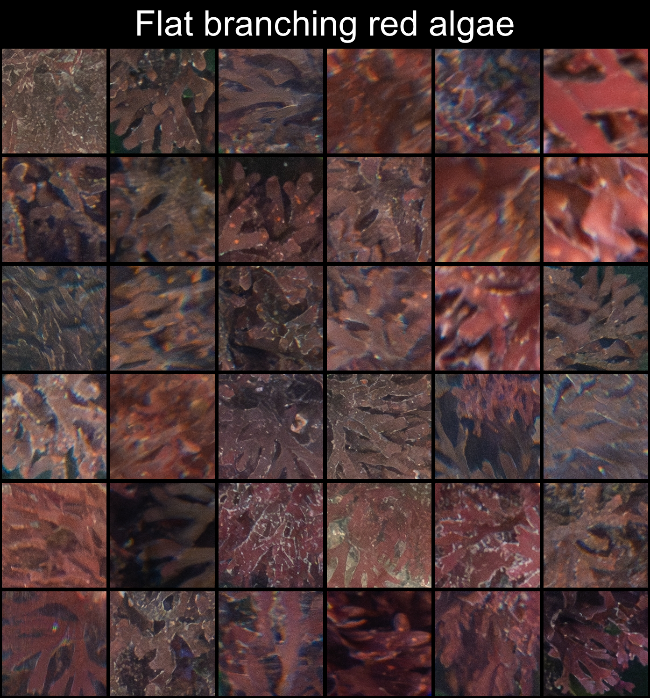
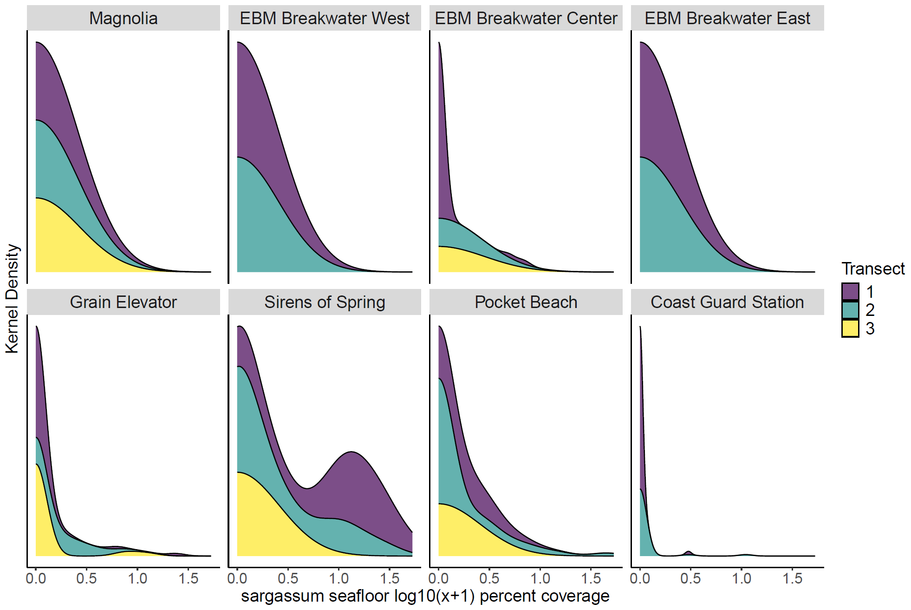

# CCR benthic analyses

### Overview 
This repository contains code and files necessary to work with our ROV survey imagery and the derived percent-cover and abundance data. Specifically, this repository includes code to complete a variety of tasks, ROV survey image patches used to train computer vision models, and percent-cover and abundance data extracted from the manual annotation of those models. To work with those data we include code for wrangling data, multivariate analyses of community structure, visualization of kernel densities, calculation of species diversity and species evenness metrics, and statistical analyses. 

Most R scripts that involve longer workflows include a separate script that we `source()`. For example, the main `NMDS.R` script we use to perform multivariate analyses invokes `source(NMDS_functions.R)` to run. These `..._functions.R` scripts are not noted separately below, but can be found within `..\code` alongside all other scripts. 

 &nbsp;&nbsp;&nbsp;
 &nbsp;&nbsp;&nbsp;
 

We are using [CoralNet-Toolbox](https://github.com/Jordan-Pierce/CoralNet-Toolbox) to train a ML model to generate metrics of percent-cover and abundances from our ROV imagery. You can find examples of our percent-cover image patches [here](https://github.com/Seattle-Aquarium/CCR_benthic_analyses/tree/main/data_output/patches/labels) in `data_output`, and you can find the model weights from a trained classifier [here](https://www.dropbox.com/scl/fo/ro11h5n7aaydzvij028y9/AKqxPHgltMklumPAGXxzV24?rlkey=iiuv3rcrt2uh1osuxbdy0n4xz&dl=0) on the Seattle Aquarium's DropBox.  

### code
- `wrangle_data.R`: modify the raw CoralNet annotation output, merge with ROV telemetry metadata, and save it prior to further processing. 
- `revise_categories.R`: modify the percent-cover categories within an exported CoralNet dataset.  
- `diversity_metrics.R`: calculate species richness, Shannon-Weiner diversity metric, Stimpson's diveristy metric, and Peilou's evenness for percent-cover data or the combination of percent-cover and abundance data.
- `species_density.R`: calculate species density metrics. 
- `NMDS.R`: perform non-metric multidimensional scaling (NMDS) analyses on a community matrix. 
- `visualization.R`: visualize NMDS ordinations, kernel densities, and species diversity metrics.
- `GLMM.R`: compile generalized linear mixed effects models with percent-cover as the response.
- `patch_aggregation.R`: extract image patches and aggregate them in custom specified grids to create figures for patch inspection, plotting, communication, etc.

### data_input
- `bull_kelp_stipes.csv` contains bull kelp stipe and bundle counts from the forward-facing video.
- `CoralNet_2022_annotations.csv` raw CoralNet annotation output. 
- `original_CoralNet_2022_dataset.csv` contains output from CoralNet annotations merged with our ROV telemetry file, containing 1479 images and 118,000 annotations in CoralNet.
- `HSIL_VIAME_2024.csv` contains ROV-diver overlap data from summer 2024 surveys.
- `Port_VIAME_2022.csv` contains summer 2022 percent-cover and abundance data.

### data_output
- `19_labels`: output folder with processed .csv files, ordinations, and other output files for our revised 19 CoralNet categories. 
- `69_labels`: output folder with processed .csv files, ordinations, and other output files for our original 69 CoralNet categories. 
- `patches`: folder containing example image patches extracted from our Toolbox datasets. 

### figs
- output folder for various figures 

  
  
 

 

  
 

 
