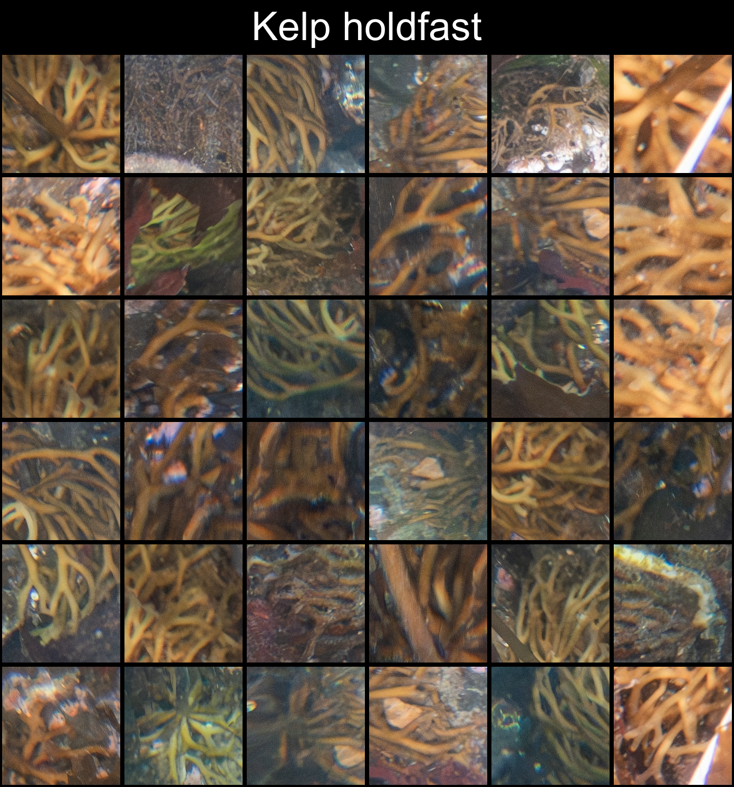
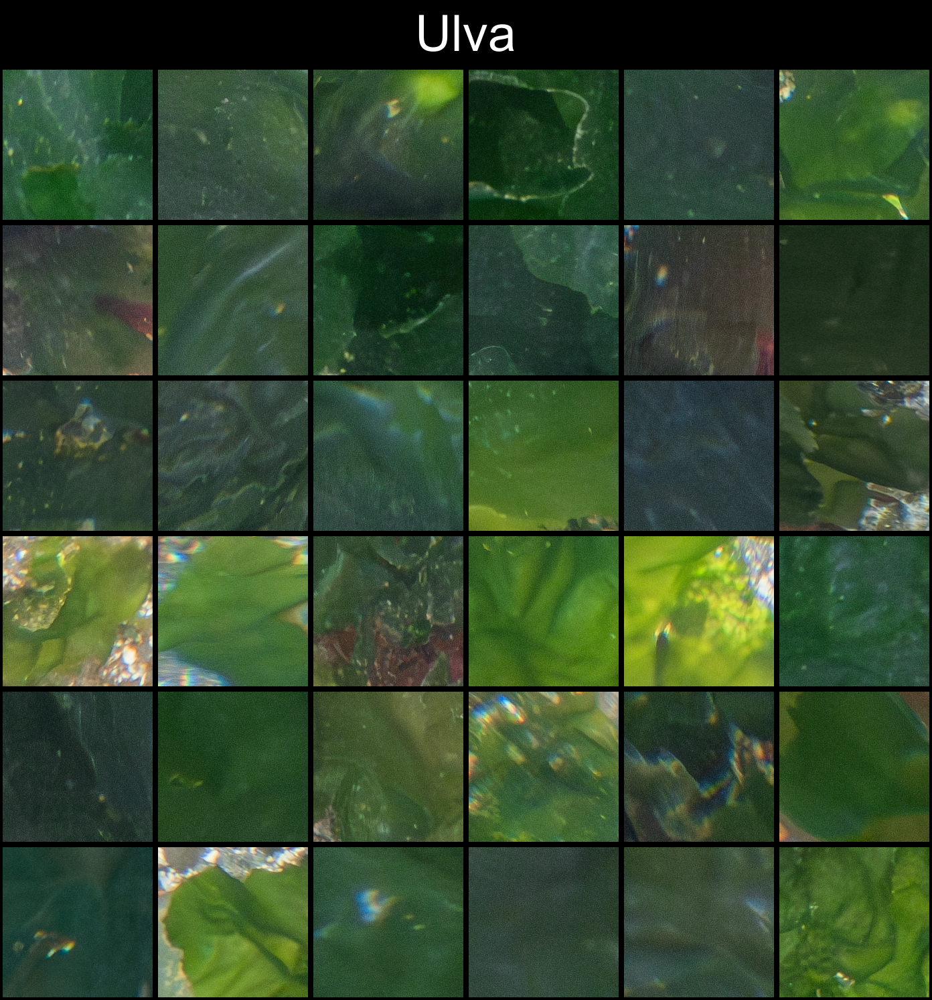
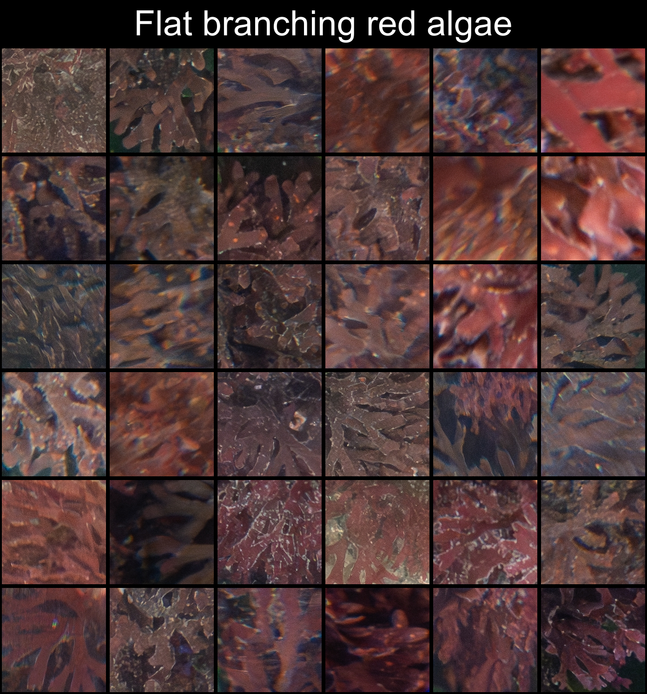
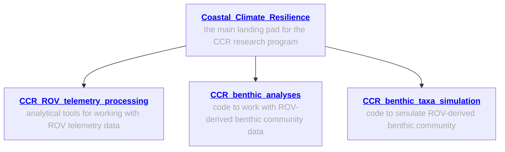
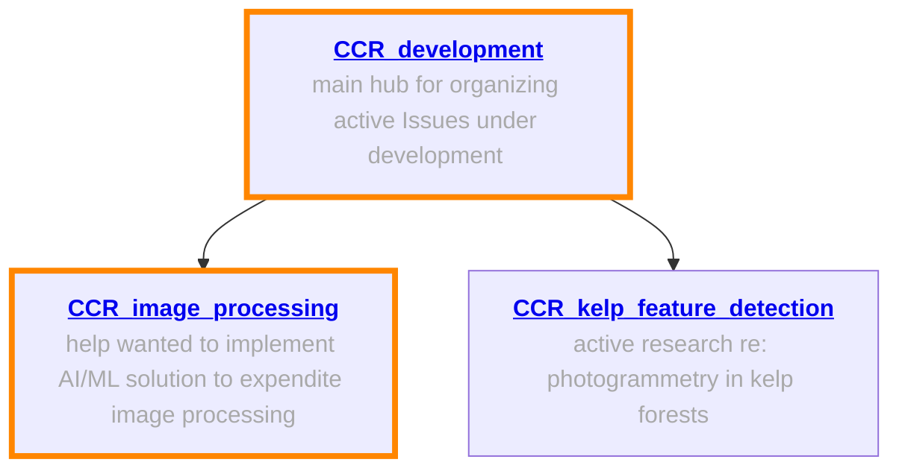

# CCR benthic analyses

### Overview 
This repository contains code and files necessary to work with our ROV survey imagery and the derived percent-cover and abundance data. Specifically, this repository includes code to complete a variety of tasks, ROV survey image patches used to train computer vision models, and percent-cover and abundance data extracted from the manual annotation of those models. To work with those data we include code for wrangling data, multivariate analyses of community structure, visualization of kernel densities, calculation of species diversity and species evenness metrics, and statistical analyses. 

Most R scripts that involve longer workflows include a separate script that we `source()`. For example, the main `NMDS.R` script we use to perform multivariate analyses invokes `source(NMDS_functions.R)` to run. These `..._functions.R` scripts are not noted separately below, but can be found within `..\code` alongside all other scripts. 

 &nbsp;&nbsp;&nbsp;
 &nbsp;&nbsp;&nbsp;
 

### Machine learning (ML) processing of survey imagery  
We are training ML models to generate data from our ROV survey imagery. Specifically, we are generating metrics of percent-cover classification (for aggregate taxa and substrate categories) and object detection (for individually conspicuous species). Both classification and object detection models are being trained using Ultralytics via [CoralNet-Toolbox](https://github.com/Jordan-Pierce/CoralNet-Toolbox). The use of Ultralytics by Toolbox allows numerous augmentations and transformations of the patches and objects (depicted via the figure below), enabling a more robust model due to the variation introduced.

#### Percent-cover classification
* We have categorized **31 percent-cover classes**, including red, green, and brown algae, substrate types, sessile and mobile species. View our label set [here](https://www.dropbox.com/scl/fi/o2oxc0fen94m5o8x5a5el/percent_cover_labelset.xlsx?rlkey=kh8dlx9fpo9pz5wxnn8eaq5e4&dl=0).
* You can find examples of our percent-cover image patches [here](https://github.com/Seattle-Aquarium/CCR_benthic_analyses/tree/main/data_output/patches/labels) in `data_output`.
* See the confusion matrix linked [here](https://github.com/Seattle-Aquarium/CCR_benthic_analyses/blob/main/figs/readme_images/matrix.png) for the current predicted vs real percent-accuracy of our model (with an overall model accuracy = 91.5%).
* You can find the model weights from a trained classifier [here](https://www.dropbox.com/scl/fo/ro11h5n7aaydzvij028y9/AKqxPHgltMklumPAGXxzV24?rlkey=iiuv3rcrt2uh1osuxbdy0n4xz&dl=0) on the Seattle Aquarium's DropBox.
  

#### Object detection
* We are training an object detection model to automate identification of animals in survey imagery. Annotations to create the training the dataset are being created in VIAME thanks to our hardworking "AI Teacher" volunteers. View the species list [here](https://www.dropbox.com/scl/fi/v8k7ndggqiwn6cdxrfnyj/objects_labelset.xlsx?rlkey=p26n0qj0jekl5j0s0cbt2g1bj&dl=0).

## General information; workflows ready to implement
The following repos contain general information about our work, and specialized repos for ROV telemetry analyses, processing and analyses of ROV-derived benthic abundance and distribution data, and simulating benthic data.  

```mermaid
graph TD

A["<a href='https://github.com/Seattle-Aquarium/Coastal_Climate_Resilience' target='_blank' style='font-size: 16px; font-weight: bold;'>Coastal_Climate_Resilience</a><br><font color='darkgray'>the main landing pad for the CCR research program</font>"]

A --> E["<a href='https://github.com/Seattle-Aquarium/CCR_analytical_resources' target='_blank' style='font-size: 16px; font-weight: bold;'>CCR_ROV_telemetry_processing</a><br><font color='darkgray'>analytical tools for working with ROV telemetry data</font>"]

A --> F["<a href='https://github.com/Seattle-Aquarium/CCR_benthic_analyses' target='_blank' style='font-size: 16px; font-weight: bold;'>CCR_benthic_analyses</a><br><font color='darkgray'>code to work with ROV-derived benthic community data</font>"]

A --> G["<a href='https://github.com/Seattle-Aquarium/CCR_benthic_taxa_simulation' target='_blank' style='font-size: 16px; font-weight: bold;'>CCR_benthic_taxa_simulation</a><br><font color='darkgray'>code to simulate ROV-derived benthic community</font>"]
```

## Help wanted! 
The following repos involve active areas of open-source software development, AI/ML implementation, and computer vision challenges; areas where we could use assistance are 🔶 highlighted in orange 🔶

```mermaid
graph TD

B["<a href='https://github.com/Seattle-Aquarium/CCR_development' target='_blank' style='font-size: 16px; font-weight: bold;'>CCR_development</a><br><font color='darkgray'>main hub for organizing active Issues under development </font>"]

B --> C["<a href='https://github.com/Seattle-Aquarium/CCR_image_processing' target='_blank' style='font-size: 16px; font-weight: bold;'>CCR_image_processing</a><br><font color='darkgray'>help wanted to implement AI/ML solution to expendite image processing</font>"]

B --> D["<a href='https://github.com/Seattle-Aquarium/CCR_kelp_feature_detection' target='_blank' style='font-size: 16px; font-weight: bold;'>CCR_kelp_feature_detection</a><br><font color='darkgray'>active research re: photogrammetry in kelp forests</font>"]

style B stroke:#FF8600,stroke-width:4px
style C stroke:#FF8600,stroke-width:4px
```
 
