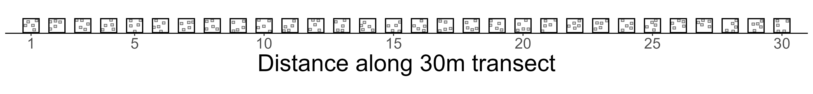

# ROVs and scuba divers: a paired methods comparison

## Background
Scientific SCUBA divers have long been the primary means of monitoring benthic kelp forest communities, but diver-based survey capacity is inherently constrained by safety, bottom time, and the area a single dive team can realistically cover. Small, modular remotely operated vehicles (ROVs) offer a practical way to expand that capacity — extending visual access to greater depths and spatial extents while capturing standardized, georeferenced imagery that can be annotated well after the survey itself. Since 2022 the Seattle Aquarium has developed a comparatively low-cost, open-source framework for conducting benthic ROV surveys in Washington's kelp forests, but until now no systematic, quantitative comparison of ROV- and diver-derived data existed for Puget Sound kelp forests — a gap explicitly flagged by the Puget Sound Kelp Conservation and Recovery Plan workgroup as a priority next step.

This repository contains the code, data, and results for a direct, paired comparison of ROV- and diver-derived data, collected from the same locations, depths, and days, at two structurally distinct sites in Elliott Bay: a soft-sediment site at **Centennial Park** and a boulder/riprap site along the **Elliott Bay Marina breakwater**. We compare (**1**) abundance of discrete macroinvertebrates and (**2**) percent-cover of macroalgae and substrate between the ROV and scientific divers following Reef Check's Kelp Forest Monitoring Program protocol.

### Full technical report
The complete write-up — methods, statistical modeling, results, discussion, and all figures/tables — lives at [`report/main/main.tex`](report/main/main.tex). The compiled **`main.pdf` is available on [Dropbox](https://www.dropbox.com/scl/fi/jiqdh82ez3y84cbfkywt3/main.pdf?rlkey=kmv4jawon1r7zqxg2c18ddten&dl=0)** rather than tracked in this repo — at ~490 MB (embedded full-resolution survey photos), it exceeds GitHub's 100 MB per-file push limit. For the same reason, one figure — `categories.png` (144 MB) — is also excluded from git; it's available on [Dropbox](https://www.dropbox.com/scl/fi/1c0u4vefoefhyvmaw7yn9/categories.png?rlkey=r4xeki2oxc6pqtdch27txt6wi&dl=0) instead. Everything else under `report/` (LaTeX source, bibliography, and the rest of the figures) is tracked normally. This README summarizes that report's design, pipeline, and headline results for anyone working in this repo's code/data.

## Sampling design
- We surveyed **2 sites** in Elliott Bay: **Centennial Park** (soft-sediment; the site is also referred to as "Sirens of Spring" in some raw files) and the **Elliott Bay Marina breakwater** (boulder/riprap).
- At each site we surveyed **6 replicate transects**: 3 at a **shallow** (5 m) depth and 3 at a **deep** (10 m) depth, laid parallel to shore and back-to-back with 5 m spacing between transects within a depth.
- Each transect is 30 m long, delineated by a surveyor's tape laid along the seafloor; divers survey a 1 m-wide swath on each side of the tape (2 m total), and the ROV is flown at a fixed altitude of 0.8 m to generate imagery of comparable width.
- Every one of the 12 physical transect locations (2 sites × 2 depths × 3 replicates) was surveyed **twice** — once in **summer 2024** and once in **winter 2025** — giving **24 total site × transect × season combinations** (n = 24), each surveyed by both platforms on the same day.

<p align="center">

</p>

<p align="center">

</p>

The two sites capture structurally distinct benthic environments — soft sediment vs. boulder/reef structure — and we expect (and don't try to erase) real differences in community composition between sites and depths. The point of this study is not to characterize the sites themselves, but to ask how the two survey **methods** compare when pointed at the same seafloor on the same day.

## Field methods
- **Divers:** Reef Check's Kelp Forest Monitoring Program protocol — a 1 m swath count of discrete macroinvertebrates on each side of the tape, plus a uniform point-contact (UPC) percent-cover survey at 30 points (one per meter) along the transect.
- **ROV:** Blue Robotics BlueROV2, flown at 0.8 m altitude, with a GoPro HERO 12 downward-facing camera capturing 27.3 MP RAW photographs (roughly one photo per meter of forward movement, selected via an EKF-fused telemetry pipeline — DVL altitude/velocity + USBL position + IMU — to minimize photo overlap along a transect). Full hardware and telemetry-processing detail lives in the companion field methods manuscript/repo, [`CCR_ROV_survey_methods`](https://github.com/Seattle-Aquarium/CCR_ROV_survey_methods).

## Data processing pipeline
**To reproduce everything below in one step**, run [`code/RunMe.R`](code/RunMe.R) (`Rscript RunMe.R` from `code/`, or open it in RStudio and Source it with `code/` as the working directory). It's the single entry point: it loads every package the pipeline needs ([`load_packages.R`](code/load_packages.R)), defines every file path used anywhere below, and then runs each stage in order. No other script in `code/` loads its own packages, sets its own working directory, or redefines these paths — RunMe.R is the one place all of that lives. Two of RunMe.R's stages (rebuilding the VIAME abundance QA imagery, and the NMDS ordination) are slow, so by default RunMe.R skips them and reuses their existing cached output; see the "Choices" section near the top of RunMe.R to force a fresh run of either.

The stage-by-stage breakdown below describes what RunMe.R runs, and the individual scripts, for anyone who wants to run or modify one stage on its own rather than the whole pipeline. Most longer-workflow R scripts in `code/` `source()` a companion `..._functions.R` file (not listed separately below).

### Abundance (discrete macroinvertebrates)
1. Diver counts are wrangled by [`wrangle_diver_data.R`](code/wrangle_diver_data.R) into [`results/diver/diver_invert_abundance.csv`](results/diver/diver_invert_abundance.csv).
2. ROV abundance comes from manual VIAME annotations of every visible macroinvertebrate. [`annotate_viame_detections.R`](code/annotate_viame_detections.R) and [`build_HSIL_viame_abundance_corrected.R`](code/build_HSIL_viame_abundance_corrected.R) parse the raw VIAME JSON exports (`data/ROV/VIAME_JSON_export_abundances/`), resolve each detection to its true transect via a ground-truth folder crosswalk (`data/ROV/HSIL_viame_transect_ground_truth.csv` — the VIAME export's own transect ID is unreliable), and write both a QA/QC annotated-image folder and per-photo/per-transect counts to [`results/ROV/abundance/`](results/ROV/abundance/).
3. [`build_combined_abundance.R`](code/build_combined_abundance.R) joins the two into [`results/combined/ROV_diver_abundance_combined.csv`](results/combined/ROV_diver_abundance_combined.csv) (48 rows: 24 transects × 2 methods), restricted to the 10 taxa recorded by both platforms.
4. [`abundance_models.R`](code/abundance_models.R) fits a negative binomial GLMM (`count ~ type + site + season + depth + (1|transect_id)`) per taxon, writing results to `results/combined/abundance_model_results*.csv`.

### Percent-cover (macroalgae and substrate)
1. Diver UPC data is wrangled by [`wrangle_diver_data.R`](code/wrangle_diver_data.R) into [`results/diver/diver_UPC_percentage.csv`](results/diver/diver_UPC_percentage.csv).
2. ROV percent-cover comes from a YOLO11s-cls classification model trained and deployed in [CoralNet-Toolbox](https://github.com/Jordan-Pierce/CoralNet-Toolbox) (27 trained categories; overall test-set accuracy 99.9%), applied to 50 randomly distributed patches per photo. [`wrangle_HSIL_percent-cover_data.R`](code/wrangle_HSIL_percent-cover_data.R) processes the raw photo-level export (`data/ROV/HSIL_percent_cover.csv`, 30 percent-cover category columns) into [`results/ROV/percent_cover/`](results/ROV/percent_cover/) at photo-level and transect-averaged resolutions.
3. Toolbox model predictions are manually verified by trained volunteers via **Kelp Quest**, our Zooniverse citizen-science project (as of this writing: 4,111 volunteers, 582,458 classifications) — see the technical report's Methods for the full workflow.
4. [`build_combined_percent_cover.R`](code/build_combined_percent_cover.R) crosswalks ROV and diver category names (combining/joining categories where resolution differs between platforms — see comments in that script) into [`results/combined/ROV_diver_percent_cover_combined.csv`](results/combined/ROV_diver_percent_cover_combined.csv), restricted to the 8 categories directly comparable between platforms.
5. [`percent-cover_models.R`](code/percent-cover_models.R) fits a beta-binomial GLMM (`proportion ~ type + site + season + depth + (1|transect_id)`) per category, writing results to `results/combined/percent_cover_model_results*.csv` (all-season and winter-only refits).

### ROV–diver correlations (agreement in pattern)
The GLMMs above ask whether one platform records systematically **more** than the other — a question about *level*. [`correlations.R`](code/correlations.R) asks the complementary question: do the two platforms rise and fall **together** across transects? It mirrors the model scripts' structure exactly — all 8 percent-cover categories, then the winter-only subset (CCA + the 5 substrate categories), then all 10 abundance taxa — and writes to `results/combined/correlation_*.csv`. Each row reports Pearson's *r* with its 95% CI, Spearman's ρ (rank-based, to expose categories whose *r* rests on one or two extreme transects), the mean and max per-transect gap between the two platforms' z-scored values, and a pooled within-site correlation that strips out the between-site contrast. Note that because standardization is a linear transformation, the correlation between the two platforms' z-scored series is numerically identical to the correlation between their raw values — the z-score outputs add the common-scale |Δz| columns and a pooled cross-taxon statistic, not a different *r*. Ready-to-use LaTeX versions of these tables live in [`report/main/correlation_tables.tex`](report/main/correlation_tables.tex).

### Community structure and full-resolution exploration
- [`NMDS.R`](code/NMDS.R) / [`NMDS_functions.R`](code/NMDS_functions.R) run a non-metric multidimensional scaling ordination on the full photo-level percent-cover matrix (all 30 categories, n = 1,436 photos), writing to [`results/ROV/NMDS/`](results/ROV/NMDS/); [`NMDS_visualization.R`](code/NMDS_visualization.R) builds the ordination plots.
- [`data_visualization.R`](code/data_visualization.R) generates the head-to-head, violin, z-score, and proportion-across-space figures used in the report, written to `figs/`. The violin and proportion-across-space sweeps are generated for every percent-cover category at both sites and both seasons (not just the one example of each used in the report), for anyone who wants to look beyond the report's headline figures.

`code/` contains only the scripts in the active pipeline described above — a handful of earlier exploratory analyses (an observer-effect check, spatial-autocorrelation diagnostics, alternate chart designs) that didn't make it into the report were removed, along with a few scripts superseded by data that has since landed under a different name/shape.

## Statistical approach
- **Abundance:** negative binomial GLMM (log link), reported as **rate ratios** (ROV relative to a diver reference level).
- **Percent-cover:** beta-binomial GLMM (logit link), reported as **odds ratios** — chosen over a standard binomial to absorb spatial autocorrelation in benthic cover within a photo/transect that a naive binomial would understate.
- **Sugar kelp (*Saccharina*) and sieve kelp (*Agarum*):** these can't be compared in absolute units (diver density counts vs. ROV percent-cover), so we z-score each platform's series independently and use the Pearson correlation between the two as a test of agreement in *relative* pattern across transects.
- **Community structure:** NMDS ordination (Bray-Curtis dissimilarity) on the ROV's full photo-level percent-cover data, used as a preliminary look at what the ROV's much higher sampling resolution can reveal beyond the platform head-to-head comparison.

## Key results
- Across all 10 overlapping macroinvertebrate taxa (2,200 total observations: 994 diver, 1,206 ROV), **no taxon showed a statistically significant abundance difference** between platforms; rate ratios ranged 0.75–1.51, clustering 1.12–1.41 among the six taxa whose models converged cleanly.
- Rock crab was the one taxon meaningfully sensitive to a single high-density transect (Centennial Park, winter, T1: 62 diver / 130 ROV) — a density-dependent artifact discussed at length in the report, not a sign the platforms disagree systematically.
- **Red and green algae percent-cover** showed no meaningful method effect (green: OR = 0.92, p = 0.705; red: OR = 0.73, p = 0.062).
- **Substrate percent-cover** differed significantly for 5 of 6 categories, with the ROV consistently recording *lower* odds than divers (CCA, boulder, pebble, sand, shell hash) — a structural difference in how the two platforms sample substrate under vegetation, not a classification error. Restricting to winter (when vegetation is senesced) resolved or substantially weakened 2 of the 5 gaps.
- ROV and diver kelp metrics were **strongly correlated in relative pattern** despite measuring fundamentally different quantities (*Saccharina*: r = 0.96; *Agarum*: r = 0.88).
- Extending that correlation to every category and taxon shows that **agreement in level and agreement in pattern are largely independent**. Boulder differs sharply in level between platforms (OR = 0.18) yet tracks closely across transects (r = 0.85); cobble matches almost exactly in level (OR = 1.12) yet tracks not at all (r = 0.08). None of the 10 invertebrate taxa differed significantly in level, but their correlations span 0.96 (burrowing sea cucumber) down to 0.23 (kelp crab). Where pattern agreement fails, it fails because at least one platform is near its detection or classification floor. Removing between-site variation leaves the algal categories intact (green r = 0.92, red r = 0.76 within site) but deflates substrate sharply — the ROV distinguishes substrate composition *between* structurally distinct sites more convincingly than it resolves substrate pattern *among* transects within a site.
- At full resolution (1,436 photos, 71,800 percent-cover data points across 30 categories), the ROV's photograph-level data resolves spatial and depth-related structure invisible to a single transect-scale average, and an NMDS ordination cleanly separates community composition by site and, within a site, by depth (stress = 0.134).

See the technical report's Results and Discussion for full detail, caveats, and next-step recommendations for tightening the ROV methodology.

## Repository structure
```
ROV_diver_comparison/
├── code/     R scripts: run RunMe.R to reproduce everything (see Data processing pipeline above)
├── data/     Raw diver (Reef Check) and ROV (VIAME, CoralNet-Toolbox) exports
├── results/  Processed outputs: results/diver, results/ROV (abundance, percent_cover, NMDS), results/combined
├── figs/     Report-ready figures generated by code/*visualization*.R
└── report/   Full technical report source (LaTeX + figures); main.pdf and categories.png excluded (size), see above
```
